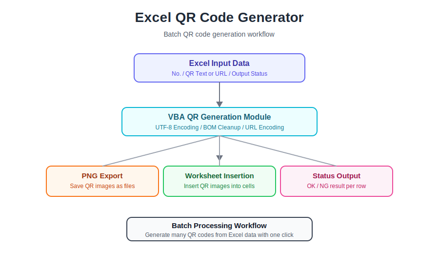

# Excel QR Code Generator

Reusable Excel VBA toolkit for batch QR code generation.

Built for situations where many QR codes need to be created efficiently from Excel data.

Generate hundreds of QR codes at once, export them as PNG files, optionally insert them into Excel worksheets, and automatically record processing history.

---

## Architecture

<p align="center">
  
</p>

---

## Features

✓ Batch QR Generation

✓ Dynamic Batch Range Detection

✓ Progress Indicator

✓ Elapsed Time Display

✓ Processing Log

✓ Automatic Log Worksheet Creation

✓ Configurable Output Folder

✓ Skip Empty Rows

✓ PNG Export

✓ Worksheet Image Insertion

✓ Button-ready Macro Entry Points

✓ UTF-8 Encoding

✓ BOM Removal

✓ Zero-width Character Cleanup

✓ URL Encoding

✓ Automatic PNG File Naming

✓ Status Reporting (OK / NG / Skip)

✓ Re-runnable Workflow

✓ Excel VBA

---

## Use Cases

### Product Labels

- Product QR codes
- Inventory labels
- Asset management

### Event Management

- Registration QR codes
- Check-in systems
- Visitor badges

### Surveys

- Questionnaire links
- Feedback forms
- Customer satisfaction surveys

### Internal Documents

- Digital manuals
- Shared resources
- Company documents

### Batch Processing

Generate hundreds of QR codes automatically from Excel without creating them one by one while keeping an execution history.

---

## Workflow

```text
Excel Data
      │
      ▼
Detect Last Data Row
      │
      ▼
Text Cleanup
      │
      ▼
UTF-8 Encoding
      │
      ▼
BOM Removal
      │
      ▼
Generate QR Code
      │
      ▼
Progress Indicator
      │
      ▼
Export PNG
      │
      ▼
Insert into Worksheet
      │
      ▼
Write Processing Log
      │
      ▼
Elapsed Time Calculation
      │
      ▼
Status Output
 (OK / NG / Skip)
```

---

## Repository Structure

```text
excel-qr-code-generator/

├── images/
│   └── architecture.svg
│
├── src/
│   └── QRGenerator.bas
│
├── LICENSE
└── README.md
```

---

## Technical Highlights

### QR Generation

- Batch QR code generation
- Dynamic last-row detection
- Quiet zone (margin) control
- Real-time processing progress
- Elapsed time measurement
- PNG image export
- Automatic sequential file naming
- Zero-padded numbering

### Data Processing

- UTF-8 URL encoding
- BOM removal
- Zero-width character cleanup
- Line break removal
- Whitespace normalization
- Empty row detection

### Excel Automation

- Automatic worksheet image insertion
- Button-ready macro execution
- Configurable output folder
- Folder picker for PNG export
- Automatic processing log
- Automatic Log worksheet creation
- Progress indicator
- Status tracking
- Image resizing
- Cell fitting
- Reusable workflow

---

## Future Roadmap

### v0.2

- Improved error handling
- Batch cancellation
- Export summary
- CSV processing report

### v0.3

- Configuration worksheet
- Custom QR size
- Custom margin
- Configurable worksheet columns

### v0.4

- URL validation
- Duplicate detection
- Validation report
- Error summary

### v0.5

- Label printing support
- SVG export
- Logo QR generation
- ZIP export

---

## Current Version

**v0.1**

Released: **2026-07-14**

Status: **Stable Release**

---

## License

MIT License
